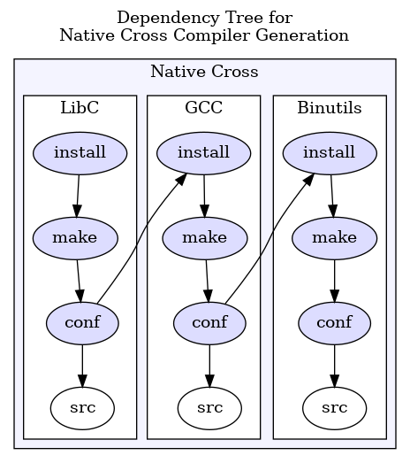
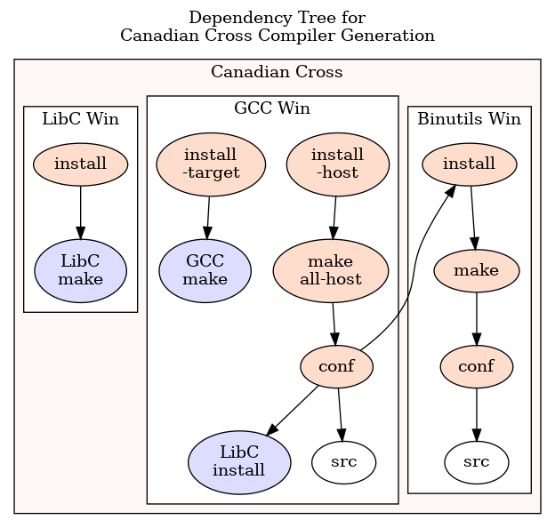

This is a `Makefile` that is supposed to build avr-gcc in a
Canadian Cross configuration.  A Canadian Cross Compiler is a compiler where
*Build*, *Host* and *Target* systems are all different,
with a layout something like:
*Build*=`x86_64-linux-gnu`, *Host*=`i686-w64-mingw32`, *Target*=`avr`.

First, it builds a Native Cross compiler (in blue).
This is a *Build*&rarr;*Target* compiler, i.e. a compiler that runs on *Build*
and generates code for *Target*.  The dependency tree looks like this:

This compiler is not contained in the distribution tarball, but it is
required to build the *Host*&rarr;*Target* compiler (in red below).
Apart from this compliler, two more toolchains must be available:
A *Build*&rarr;*Build* compiler and a *Build*&rarr;*Host* cross compiler.

The dependency tree to build the *Host*&rarr;*Target* Canadian Cross
looks like:

That is: The target libraries have already been built in the Native Cross
step; all that needs to be done is to install them with the right `prefix`.

