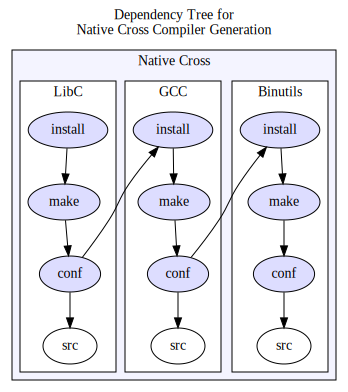
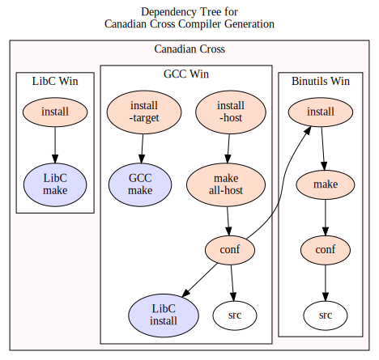

This is a `Makefile` that is supposed to build avr-gcc in a Native and/or
a Canadian Cross configuration.  A Canadian Cross Compiler is a compiler where
*Build*, *Host* and *Target* systems are all different,
with a layout something like:
*Build*=`x86_64-linux-gnu`, *Host*=`i686-w64-mingw32`, *Target*=`avr`.

## Examples

The build of a Canadian cross toolchain is as simple as
```
$ make install-w32
```
or
```
$ make -j44 GCC_VERSION=8.5.1 install-w32
```
or for the the Native cross:
```
$ make -j44 GCC_VERSION=8.5.1 install-native
```
When building a toolchain in several steps, make sure that you are using
the same values of Makefile variables like `GCC_VERSION` as listed below.


## `Makefile` Targets

| &#160;&#160;&#160;&#160;&#160;&#160;&#160;&#160;Target&#160;&#160;&#160;&#160;&#160;&#160;&#160;&#160;&#160;&#160;&#160; | Action |
---------|-----|
| [default] | Show a help screen
| `deps`    | Show (versions of) software that is required to build the Native cross toolchain.
| `deps-w32`   | Show (versions of) software that is required to build the Canadian cross toolchain.
| `all-native` | Build a Native cross AVR toolchain, including downloading the sources as needed, but don't install.
| `install-native` | Do `all-native` and install the resulting Native cross toolchain, minding all prerequisites. The install will be in folder `./install-native`.
| `all-w32`    | Build a Canadian cross AVR toolchain for the `HOST_W32` host, including downloading the sources, building and installing a Native cross toolchain as needed, but don't install the Canadian.
| `install-w32`  | Do `all-w32` and install the resulting Canadian cross toolchain, minding all prerequisites. The install will be in folder `./install-w32`.
| `deploy-native` | Build a `.tar.xz` tarball from `install-native` including an `ABOUT.txt`.
| `deploy-w32` | Build a `.tar.xz` tarball from `install-w32` including an `ABOUT.txt`.


## `Makefile` Variables

The script builds the tools from the GIT sources according to
the `TAG` variables below, which specify the GIT branch or tag to use.

| Variable | Default | Meaning |
|---|---:|---|
| `HOST_W32`    | `i686-w64-mingw32` | Host OS for the Canadian cross
| `GCC_VERSION` | `15.2`             | GCC version
| `TAG_GCC`     | `releases/gcc-$(GCC_VERSION).0` except for 8.5.1 | git tag/branch for GCC
| `TAG_BIN`     | `binutils-2_45_1` | git tag/branch for Binutils
| `TAG_LIBC`    | `main` | git tag/branch for AVR-LibC
| `HTML`        | `1`    | Include HTML documentation?
| `PDF`         | `0`    | Include PDF documentation?
| `AVRDUDE_VERSION` | `8.1` | Version of AVRDUDE to download and include in the Canadian cross tarball
| `CONF`        | &mdash; | Extra GCC Native cross configure args
| `CONF_W32`    | &mdash; | Extra GCC Canadian cross configure args
| `CONF_GCC`    | &mdash; | Extra GCC Native and Canadian config args
| `CONF_BIN`    | &mdash; | Extra Binutils Native and Canadian config args
| `PATCHES`     | &mdash; | Patches to apply to sources

## Dependencies

First, it builds a Native Cross compiler (in blue).
This is a *Build*&rarr;*Target* compiler, i.e. a compiler that runs on *Build*
and generates code for *Target*.  The dependency tree looks like this,
where the graphs are understood as transitive:



This compiler is not contained in the Canadian distribution tarball, but it is
required to build the *Host*&rarr;*Target* compiler (in red below).
Apart from this compliler, two more toolchains must be available:
A *Build*&rarr;*Build* compiler and a *Build*&rarr;*Host* cross compiler.

The dependency tree to build the *Host*&rarr;*Target* Canadian Cross
looks like:



That is: The target libraries have already been built in the Native Cross
step; all that needs to be done is installing them with the right `prefix`.

